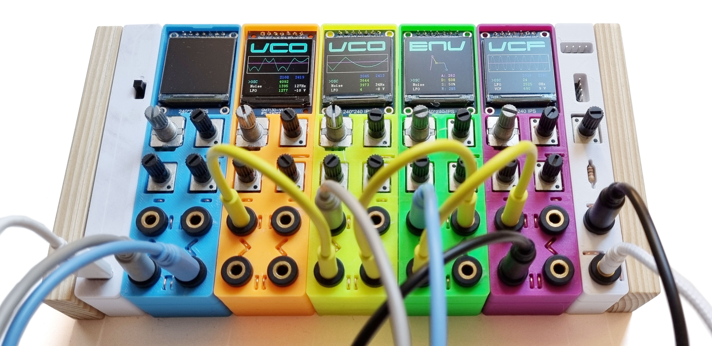
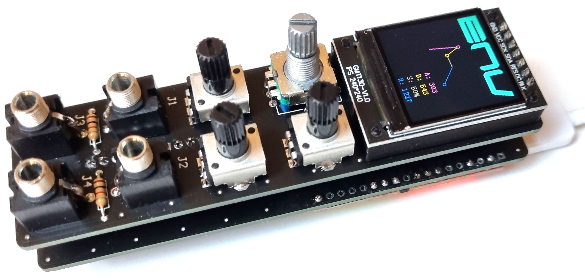
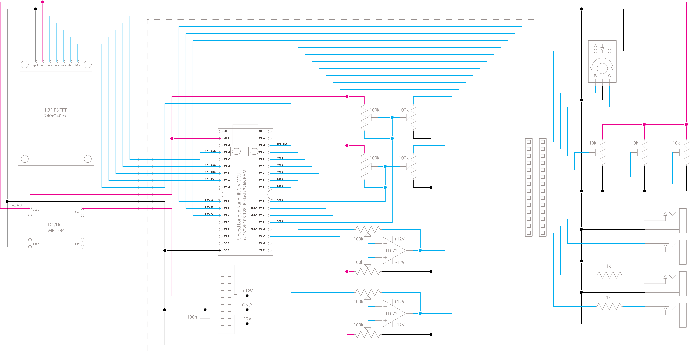

# LEET-Modular
This is the GitHub repository containing source code, schematic and 3D models for the LEET modular device: https://vonkonow.com/wordpress/leet-modular/

Description: LEET modular is a multifunctional Eurorack compatible module. It is versatile, easy to build, cheap and open source.

LEET modular offers a variety of different functions and by patching several units, advanced sounds and music can be generated.  

You can build your own device with a soldering iron and a handful of components. Everything is open source and hacking is encouraged!

Note that there are two versions:
1.	PCB version – where you can use the gerber files for a PCB order. Note that I have also designed optional 3D printed supports that protects the boards and allows units to be snapped together.

2.	3DPCB version – where the 3D printed parts with copper wires replace the need for PCB order. The 3DPCB models is currently using single turn trimpots - making them challenging to tune. I have sketched on a multi turn version. Let me know if you are interested (so I get the motivation to update the model ;)

Check out the forum where you can get support and contribute: https://vonkonow.com/wordpress/community/

For detailed building instructions visit: https://vonkonow.com/wordpress/leet-modular/
